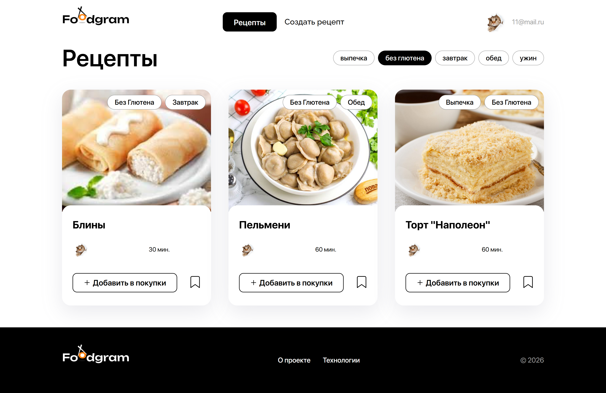

# 🍽️ Foodgram — Продуктовый помощник


Foodgram — это веб-приложение, где пользователи могут публиковать рецепты, добавлять их в избранное, подписываться на других авторов и формировать список покупок для выбранных блюд.
Проект упакован в Docker-контейнеры и автоматически разворачивается на сервере с помощью GitHub Actions (CI/CD). 

---

## 🍲 Возможности
- Регистрация и авторизация пользователей
- Публикация собственных рецептов
- Добавление рецептов в избранное
- Формирование списка покупок с возможностью его скачать в формате txt
- Подписка на других пользователей
- Фильтрация рецептов по тегам
- Автоматический деплой проекта на удалённый сервер 

---

## ⚙️ Установка и запуск проекта локально


### 1. Клонирование репозитория

```bash
git clone https://github.com/ekaterina-python-developer/celery-drf-foodgram.git
cd fcelery-drf-foodgram
```

### 2. Настройка переменных окружения

В проекте используется файл .env для хранения конфиденциальных данных (пароли, ключи, доступы).

Чтобы запустить проект:

1. Скопируйте файл-шаблон .env.example:

```
cp .env.example .env
```

2. Откройте .env и подставьте свои значения переменных.

Пример содержимого:

```
POSTGRES_USER=foodgram_user
POSTGRES_PASSWORD=foodgram_password
POSTGRES_DB=foodgram_db
DB_HOST=db
DB_PORT=5432
SECRET_KEY=your_django_secret_key
DEBUG=False
ALLOWED_HOSTS=127.0.0.1,localhost,backend,<IP_ВАШЕГО_СЕРВЕРА>
```

### 3. Запуск в контейнер

```
docker-compose up -d --build
```

После запуска проект будут доступны такие адреса:
http://localhost:8000/ - веб-приложение
http://localhost:8000/api/ - API бэкенда
http://localhost:8000/api/docs/redoc.html - документация API


## 🔌 Примеры использования API

### 1. 🚀 Регистрация пользователя
```
POST http://localhost:8000/api/users/

{
    "email": "vpupkin@yandex.ru",
    "username": "vasya.pupkin",
    "first_name": "Вася",
    "last_name": "Иванов",
    "password": "Qwerty123"
}

Ответ (201 Created):

{
    "email": "vpupkin@yandex.ru",
    "id": 1,
    "username": "vasya.pupkin",
    "first_name": "Вася",
    "last_name": "Иванов"
}
```

### 2. 🔐 Получение токена аутентификации
```
POST http://localhost:8000/api/auth/token/login/

{
    "email": "vpupkin@yandex.ru",
    "password": "Qwerty123"
}

Ответ (200 OK):

{
    "auth_token": "ваш-токен-здесь"
}
```

### 3. 🍳 Получение списка рецептов
```
GET http://localhost:8000/api/recipes/

Headers:
Authorization: Token ваш-токен-здесь

Ответ (200 OK):

{
    "count": 25,
    "next": "http://localhost:8000/api/recipes/?page=2",
    "previous": null,
    "results": [
        {
            "id": 1,
            "tags": [
                {
                    "id": 1,
                    "name": "Завтрак",
                    "slug": "breakfast"
                }
            ],
            "author": {
                "email": "chef@example.com",
                "id": 2,
                "username": "chef",
                "first_name": "Иван",
                "last_name": "Петров",
                "is_subscribed": false,
                "avatar": "http://localhost:8000/media/users/chef.png"
            },
            "ingredients": [
                {
                    "id": 1,
                    "name": "Яйцо",
                    "measurement_unit": "шт",
                    "amount": 2
                }
            ],
            "is_favorited": true,
            "is_in_shopping_cart": false,
            "name": "Омлет с овощами",
            "image": "http://localhost:8000/media/recipes/images/omelet.jpg",
            "text": "Простой и вкусный омлет...",
            "cooking_time": 15
        }
    ]
}
```
---

## 🖥️ Развёртывание на сервере (production)
### 1. Подготовка сервера (Ubuntu 24.04/22.04)
```
sudo apt update
sudo apt install -y docker.io docker-compose-v2
sudo usermod -aG docker $USER
```

### 2. Создайте SSH-ключ для GitHub Actions на сервере:
```
1. Генерация ключа
ssh-keygen -t ed25519 -C "github-actions" -f ~/.ssh/github_actions -N ""

2. Добавление ключа в список разрешенных
cat ~/.ssh/github_actions.pub >> ~/.ssh/authorized_keys

3. Установка правильных прав доступа (БЕЗ ЭТОГО SSH НЕ СРАБОТАЕТ)
chmod 700 ~/.ssh
chmod 600 ~/.ssh/authorized_keys
```

### 4. Добавьте Secrets в вашем форке репозитория:
```
SERVER_HOST: IP вашего сервера
SERVER_USER: имя пользователя на сервере
SSH_KEY: Содержимое файла ~/.ssh/github_actions (выведите его командой cat ~/.ssh/github_actions). Копируйте вместе с BEGIN и END!
SECRET_KEY: сгенерируйте через openssl rand -base64 32
DOCKERHUB_USERNAME: ваш логин Docker Hub
DOCKERHUB_TOKEN: ваш токен Docker Hub
TELEGRAM_CHAT_ID: ваш личный ID пользователя в Telegram 
TELEGRAM_BOT_TOKEN: ваш токен Telegram Bot
```

### 5. Запуск деплоя

После настройки секретов:
Сделайте push в ветку main
GitHub Actions автоматически:

- Запустит тесты
- Соберёт Docker образы
- Отправит их в Docker Hub
- Развернёт на вашем сервере
- Отправит уведомление в Telegram (если настроено)

## 🛠️ Используемые технологии

Python 3.9, Django, Django REST Framework
PostgreSQL
Celery, Redis
React
Nginx
Docker, Docker Compose
GitHub Actions (CI/CD)
Yandex Cloud

---

## 👩‍💻 Разработчик

[Екатерина Понурова](https://github.com/ekaterina-python-developer)
